# 🎬 CinePop — Frontend React

Frontend de una plataforma de reservas de cine. Permite autenticarse, explorar la cartelera, seleccionar sillas y pagar boletos con MercadoPago.

## Stack tecnológico

- **React 18** + **Vite**
- **Redux Toolkit** para manejo de estado global
- **React Router** para navegación
- **React Hook Form** para formularios
- **MercadoPago SDK** para tokenización de tarjetas
- **SCSS** personalizado

## Funcionalidades

- Registro e inicio de sesión con JWT
- Cartelera con scroll infinito y carga paginada
- Detalle de película y selección de función
- Selección visual de sillas por función
- Modal de confirmación antes del pago
- Procesamiento de pagos con MercadoPago
- Historial de compras paginado
- Rutas protegidas por autenticación

## Vista previa

### Inicio de sesión


### Cartelera con scroll infinito
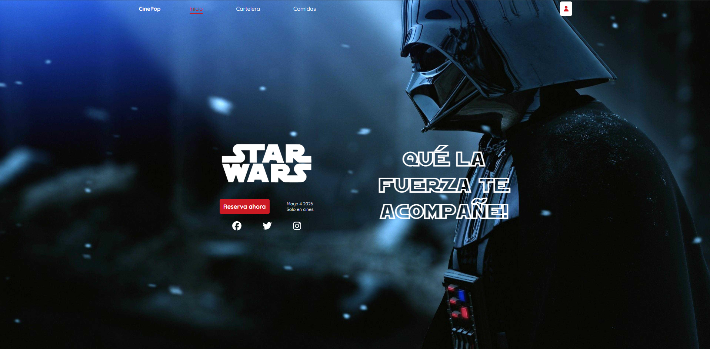
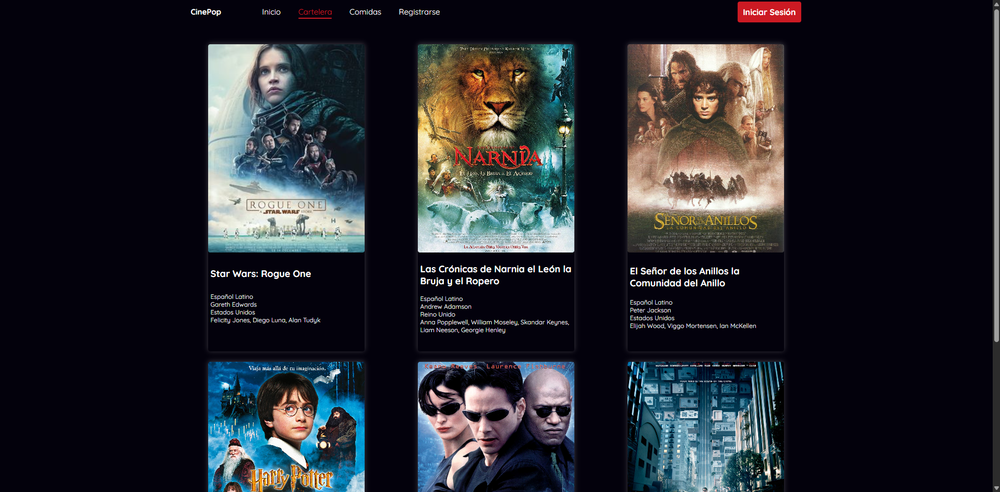
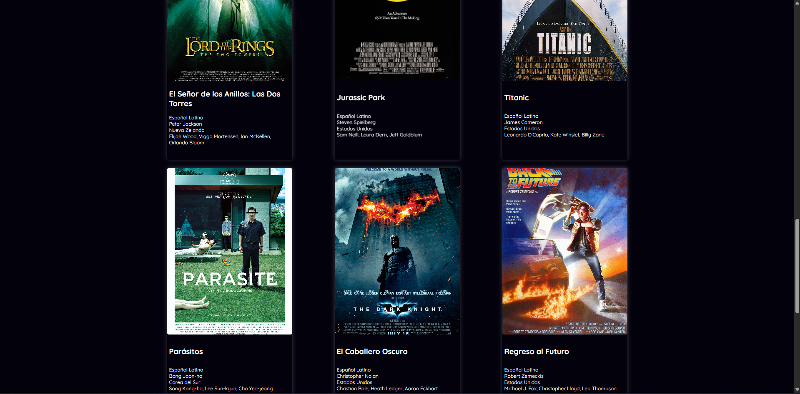

### Detalle de película y función
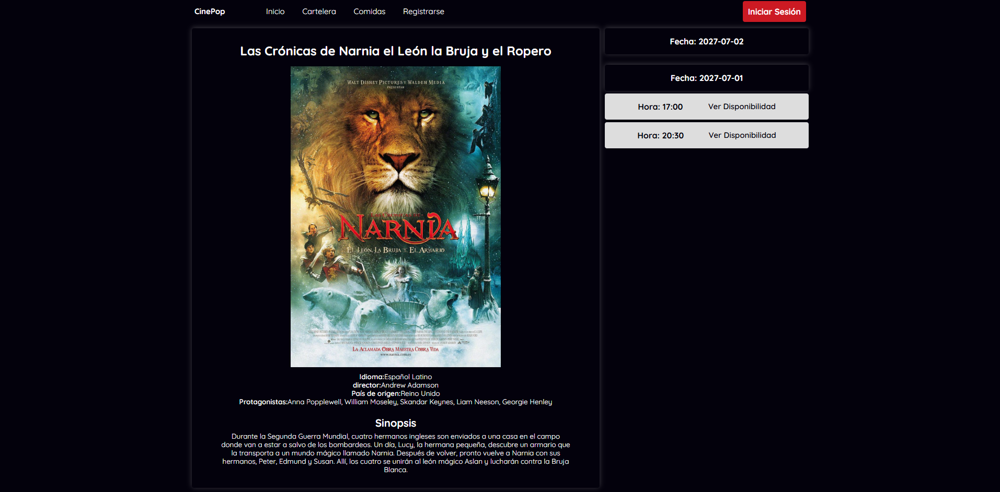

### Selección de sillas
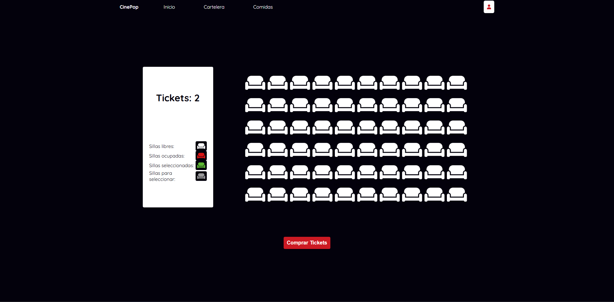
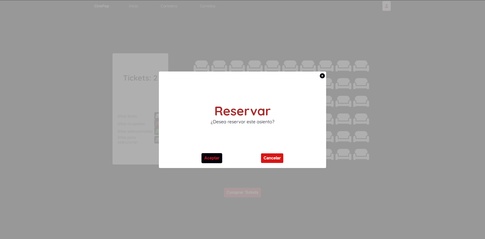
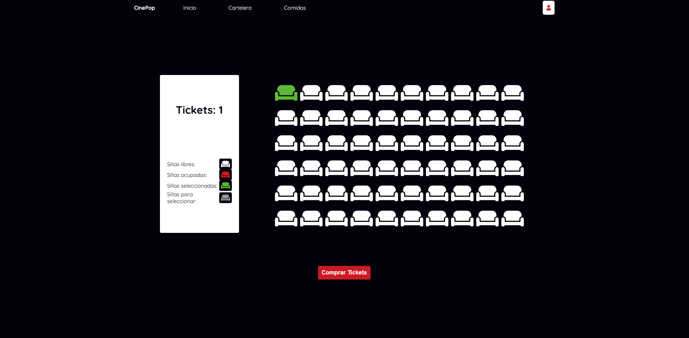
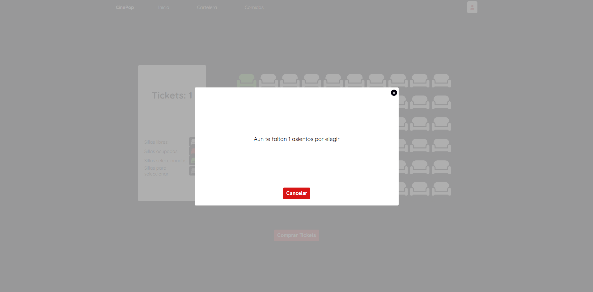
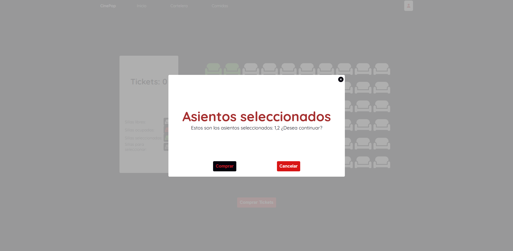

### Selección de número de boletos

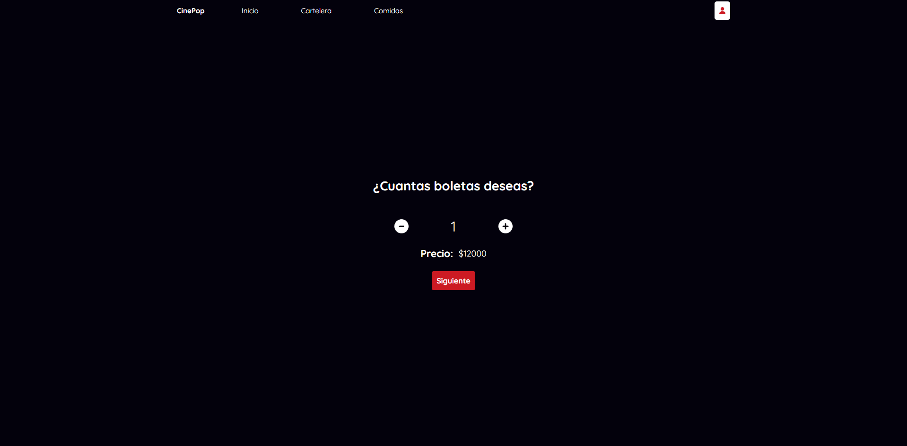
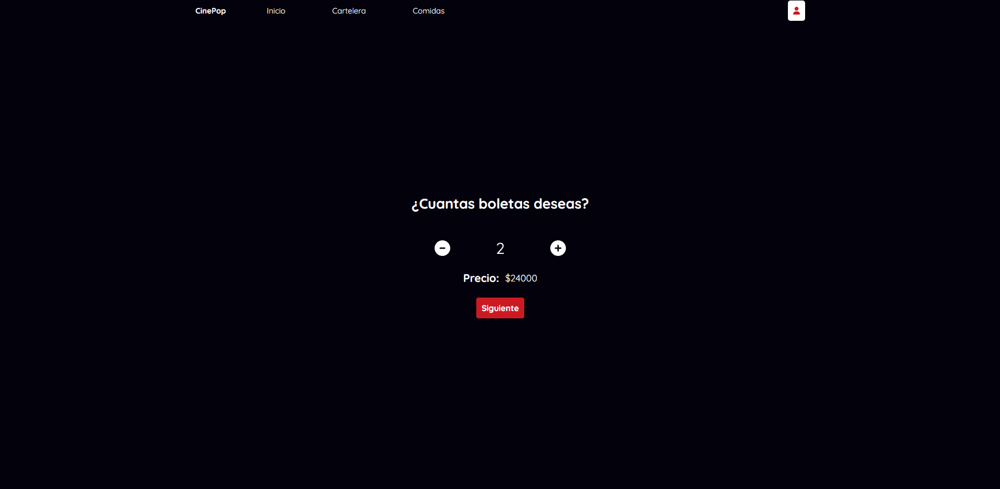

### Resumen y pago
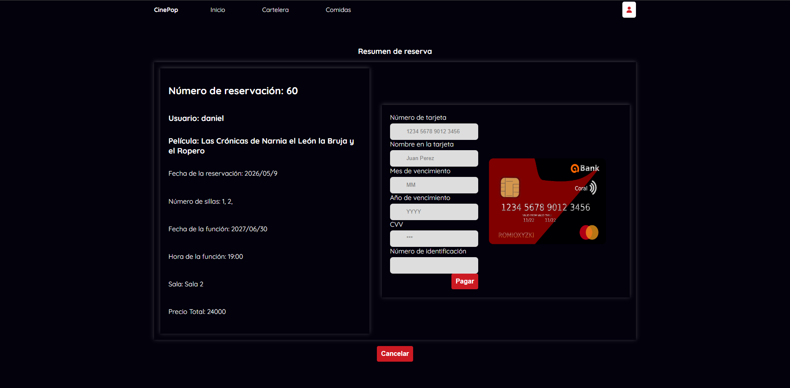

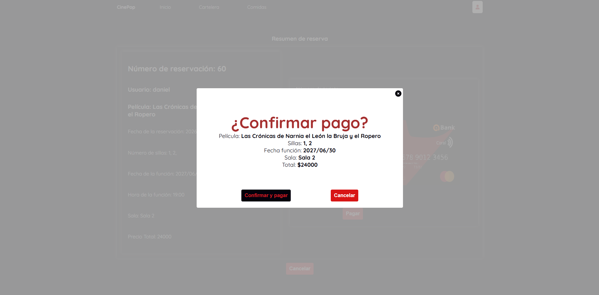
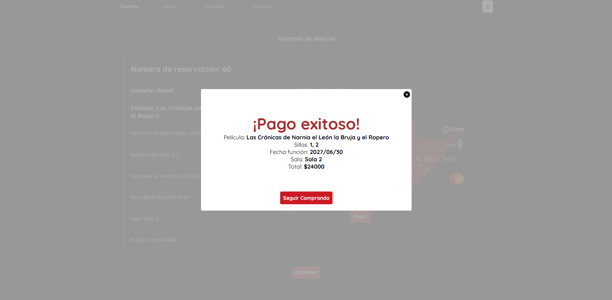

### Historial de compras
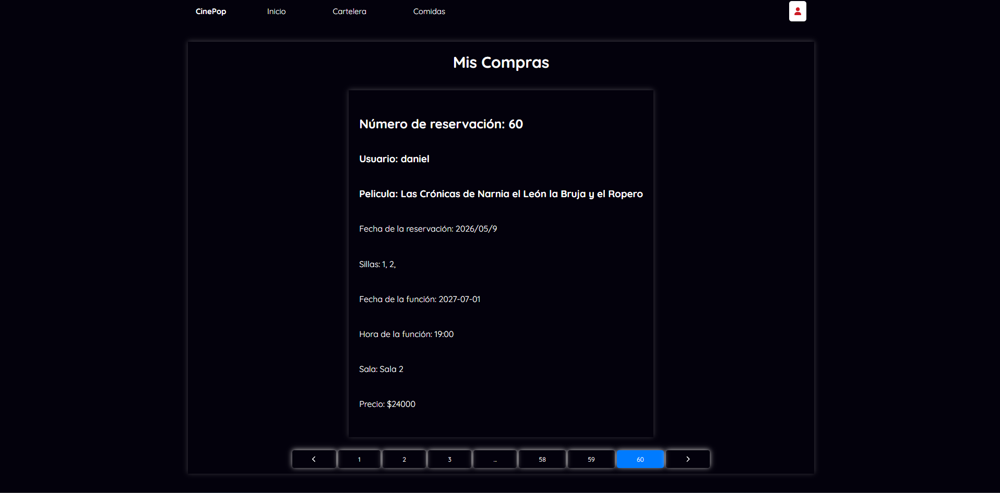

## Flujo de reserva y pago


## Cómo correrlo localmente

### Requisitos
- Node.js instalado
- Backend corriendo — ver [repositorio del backend](https://github.com/dast11lp/cinema-microservicios-backend-spring-boot)

### Pasos

```bash
git clone https://github.com/dast11lp/cinePop-React.git
cd cinePop-React
npm install
npm run dev
```

## Backend

El backend en Spring Boot con arquitectura de microservicios está disponible en:
[github.com/dast11lp/cinema-microservicios-backend-spring-boot](https://github.com/dast11lp/cinema-microservicios-backend-spring-boot)

---

Desarrollado por Daniel — Ingeniero de Sistemas
